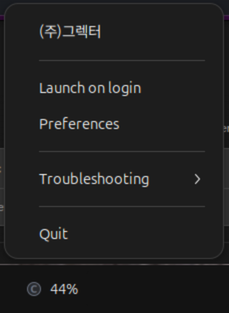

# ⚡ Claude AI Usage Widget — Linux Taskbar

A lightweight system tray widget that shows your Claude AI subscription usage percentage (5-hour and 7-day rate limit windows) directly in your Linux taskbar.


<!-- Add a screenshot.png to the repository showing the widget in action -->

## Quick Start

```bash
# Install dependencies
sudo apt install python3 python3-gi gir1.2-appindicator3-0.1 gir1.2-notify-0.7

# Install widget
git clone https://github.com/StaticB1/claude_ai_usage_widget.git && cd claude_ai_usage_widget
chmod +x install.sh && ./install.sh

# Start widget
claude-widget-start
```

## Features

- **Taskbar percentage** — shows your 5h usage % at a glance with color-coded icon
- **Click for details** — popup with 5h + 7d utilization, progress bars, reset timers, and subscription plan
- **Threshold notifications** — desktop alerts at startup, 75%, 90%, and 100% usage
- **Auto-refresh** — polls every 2 minutes (configurable)
- **Auto-detect credentials** — reads Claude Code's `~/.claude/.credentials.json` on Linux
- **Manual token entry** — dialog for manual OAuth token if you don't use Claude Code
- **Autostart** — installs a `.desktop` entry for autostart on login

## Requirements

- Linux with GTK3 (GNOME, KDE, XFCE, etc.)
- Python 3.10+
- System packages:
  ```
  sudo apt install python3 python3-gi gir1.2-appindicator3-0.1 gir1.2-notify-0.7
  ```

## Install

```bash
git clone https://github.com/StaticB1/claude_ai_usage_widget.git && cd claude_ai_usage_widget
chmod +x install.sh
./install.sh
```

Then run:
```bash
claude-widget-start
```

It will autostart on next login.

## Usage

```bash
claude-widget-start   # Start the widget
claude-widget-stop    # Stop the widget
```

The widget runs in the background and displays in your system tray.

**Check if running:**
```bash
ps aux | grep '[c]laude_usage_widget'
```

## Getting Your OAuth Token

### Option A: Claude Code (automatic)

If you have [Claude Code](https://code.claude.com) installed and logged in:

```bash
claude login   # if not already
```

The widget auto-reads `~/.claude/.credentials.json` — no extra config needed.

### Option B: Browser DevTools (manual)

1. Open https://claude.ai and log in
2. Open DevTools → **Network** tab
3. Send a message, then filter requests for `api.anthropic.com`
4. Find the `Authorization: Bearer sk-ant-oat01-...` header
5. Copy the full token starting with `sk-ant-oat01-`
6. Enter it via the widget's **Set Token…** menu item

The token is saved to `~/.config/claude-usage-widget/config.json` (mode 600).

## How It Works

Uses the same internal API endpoint Claude Code uses:

```
GET https://api.anthropic.com/api/oauth/usage
Authorization: Bearer <oauth-token>
anthropic-beta: oauth-2025-04-20
```

Returns:
```json
{
  "five_hour": { "utilization": 0.42, "resets_at": "2025-02-11T15:00:00Z" },
  "seven_day": { "utilization": 0.18, "resets_at": "2025-02-14T00:00:00Z" }
}
```

## Configuration

Edit `~/.config/claude-usage-widget/config.json`:

```json
{
  "oauth_token": "sk-ant-oat01-..."
}
```

To change refresh interval, edit `REFRESH_INTERVAL_SEC` in the Python script (default: 120s).

## Uninstall

```bash
chmod +x uninstall.sh
./uninstall.sh
```

This will remove:
- Installation directory (`~/.local/share/claude-usage-widget/`)
- Wrapper scripts (`claude-widget-start`, `claude-widget-stop`)
- Symlink (`~/.local/bin/claude-usage-widget`)
- Autostart entry (`~/.config/autostart/claude-usage-widget.desktop`)
- Application entry (`~/.local/share/applications/claude-usage-widget.desktop`)

You'll be prompted whether to keep or remove your config (OAuth token).

## Troubleshooting

| Problem | Fix |
|---|---|
| No tray icon on GNOME 43+ | Install `gnome-shell-extension-appindicator` and enable it |
| `AppIndicator3` import fails | `sudo apt install gir1.2-appindicator3-0.1` |
| `ModuleNotFoundError: No module named 'gi'` | You're using pyenv/conda Python. Use `claude-widget-start` which uses system Python |
| `symbol lookup error: libpthread.so.0` | Snap library conflict. Use `claude-widget-start` which sets clean environment |
| `command not found` after install/uninstall | Run `hash -r` to clear bash's command cache, or close/reopen terminal |
| Token expired / 401 | Re-run `claude login` (Claude Code) or re-extract from browser |
| Icon shows "ERR" | Check token validity and network connectivity |

### Python Environment Issues

If you use **pyenv**, **conda**, or other Python version managers, the `python3-gi` system package may not be accessible. The installer creates wrapper scripts (`claude-widget-start`/`claude-widget-stop`) that automatically use the system Python (`/usr/bin/python3`) with a clean environment to avoid conflicts.

### Checking Logs

If the widget fails to start or behaves unexpectedly, check the log file:

```bash
cat /tmp/claude-widget.log
```

Common issues in logs:
- **Symbol lookup errors**: Snap library conflicts (use `claude-widget-start`)
- **Module import errors**: Python environment issues (use `claude-widget-start`)
- **HTTP 401/403 errors**: Token expired or invalid (refresh token)
- **Network errors**: Check internet connectivity or API availability

## License

MIT

## Author

Created by **Statotech Systems**

---

Made with ⚡ by [Statotech Systems](https://github.com/StaticB1)
