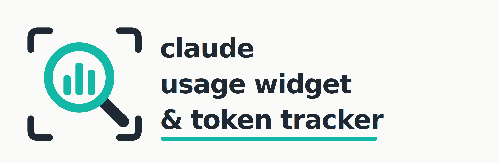
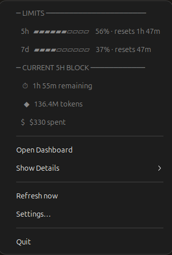
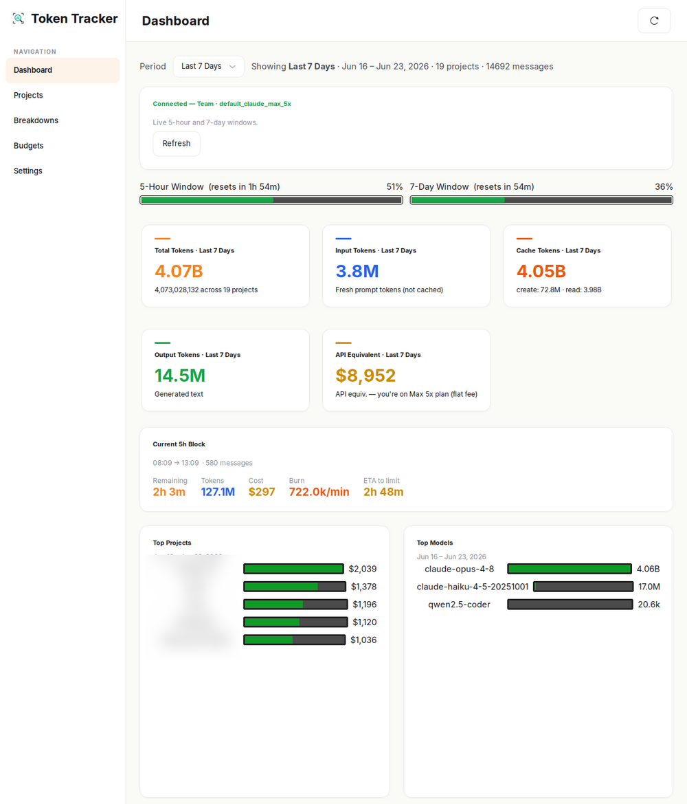

<p align="center">
  
</p>

<h1 align="center">Claude Usage Widget &amp; Token Tracker</h1>

<p align="center">
  <b>Two tools in one.</b> A live tray <b>usage widget</b> that watches how close you are to your
  Claude plan limits, and a persistent local <b>token tracker</b> that shows where your
  tokens and dollars actually go — per project, per model, per tool.
</p>

<p align="center">
  MIT · Linux GTK dashboard + cross-platform CLI · Python 3.8+ · zero Python dependencies
</p>

> **Unofficial project.** Claude Usage Widget & Token Tracker is a third-party
> tool and is **not affiliated with, endorsed by, or sponsored by Anthropic**.
> "Claude", "Claude Code", and "Anthropic" are trademarks of Anthropic, PBC,
> used here only to describe what the tool works with. Please read
> [Disclaimer & trademarks](#disclaimer--trademarks) — especially the note on
> the live usage feature, which uses your Claude OAuth token.

---

## Two halves, one app

| | 🟢 **Usage Widget** (live) | 📊 **Token Tracker** (local) |
|---|---|---|
| **Question it answers** | "How close am I to my plan limit *right now*?" | "Where did my tokens and money go?" |
| **Data source** | Your Claude plan's live 5h / 7d utilization (claude.ai usage API) | Your on-disk Claude Code logs (`~/.claude/projects`) |
| **Surface** | System-tray gauge + escalation notifications | CLI (`ctt`) + GTK dashboard + SQLite history |
| **Needs network/token?** | Yes — reads the `claude` CLI OAuth token (see the risk note) | No — 100% offline, never touches your token |
| **Platforms** | Linux tray (GTK) | CLI on Linux/macOS/Windows; dashboard on Linux |

The widget is the spiritual successor to **claude_ai_usage_widget**; the tracker
is the new half built on top of it. You can use either half on its own — disable
the live polling and it's a pure local analytics tool; ignore the dashboard and
the tray gauge behaves like the original widget.

<p align="center">
  
</p>
<p align="center"><sub><b>1 · The usage widget</b> — live 5h / 7d plan limits, current-block burn &amp; spend, and quick actions, straight from the system tray.</sub></p>

<p align="center">
  
</p>
<p align="center"><sub><b>2 · The token tracker</b> — local history: per-project / per-model spend, budgets, and 5-hour block forecasts (project names blurred).</sub></p>

## Features

**Usage Widget (live plan limits)**
- **Tray gauge** — a color-coded ring showing your current **5-hour** plan
  utilization at a glance, mirroring Anthropic's `claude /usage` semantics.
- **5h + 7d rolling windows** — see both the short and weekly limit usage, with
  reset countdowns.
- **ETA-to-limit** — projects when you'll hit your cap at the current burn rate.
- **Escalation notifications** — desktop alerts at 75% / 90% / 100% of a window.
- **Multi-account** — track several Claude logins at once, each with its own
  tray readout; hide any account from the tray or disable its polling.

**Token Tracker (local analytics)**
- **SQLite history** at `~/.config/claude-token-tracker/history.db` that
  **survives `~/.claude/projects` cleanup** — the live widget only ever saw
  current state; this keeps months of it.
- **Per-project / per-model / per-tool** attribution — see which projects, which
  model, and which tool calls (`Bash`, `Read`, `Edit`, `Agent`, …) drive spend.
- **Cost estimates** — priced from a built-in rate card you can override.
- **Local 5-hour block + forecast** — a self-computed rolling block with
  burn-rate and time-to-block-end, derived entirely from your logs (no token
  required).
- **Budgets** — daily / weekly / monthly **USD or token** caps, scoped globally,
  per-project, or per-model; plus optional **plan-utilization %** budgets that
  ride the live 5h/7d windows. Desktop notification when crossed.
- **Cross-platform CLI (`ctt`)** — table or `--json` output for shell prompts,
  status bars, and CI checks.
- **GTK dashboard (Linux)** — Dashboard, Projects, Breakdowns, Budgets, and
  Settings views, with a System / Light / Dark theme switch; backs off live
  polling when hidden.

## Install

### One-line install (any Linux distro)

```bash
curl -fsSL https://github.com/StaticB1/claude_ai_usage_widget/raw/main/install.sh | bash
```

The script installs GTK3 bindings via your distro's package manager
(apt / dnf / pacman / zypper), drops the app into
`~/.local/share/claude-token-tracker`, registers **`claude-token-tracker`** (GUI)
and **`ctt`** (CLI) in `~/.local/bin`, installs hicolor icons, and adds a login
autostart entry. Skip autostart with:

```bash
curl -fsSL https://github.com/StaticB1/claude_ai_usage_widget/raw/main/install.sh | bash -s -- --no-autostart
```

### From a clone

```bash
git clone https://github.com/StaticB1/claude_ai_usage_widget.git
cd claude_ai_usage_widget
bash install.sh                    # add --no-autostart to skip login startup
```

### Upgrading from the old widget

> **v2 is a rebrand, not a drop-in update.** The original single-file
> **claude_ai_usage_widget** installed as `claude-usage-widget` (binaries
> `claude-widget-start`/`-stop`, config in `~/.config/claude-usage-widget`).
> v2 is **Claude Usage Widget & Token Tracker**, installed as
> `claude-token-tracker` (+ the `ctt` CLI) under all-new paths. Because the
> paths differ, **installing v2 doesn't remove v1** — the old widget would
> keep auto-starting on login alongside the new one until you clear it.

**If you installed the old widget with the one-line installer (no repo folder),
just run the installer again** — it now detects the old `claude-usage-widget`,
stops it, and removes its files (dir, `claude-widget-start`/`-stop` binaries,
and autostart entry) before installing v2:

```bash
curl -fsSL https://github.com/StaticB1/claude_ai_usage_widget/raw/main/install.sh | bash
```

**If you have a clone**, one command pulls the latest and runs the same migration:

```bash
cd claude_ai_usage_widget
git pull        # or: bash upgrade.sh, which pulls + reinstalls + relaunches for you
bash install.sh
```

Either way your data carries over automatically: the live widget re-reads the
OAuth token from `~/.claude/.credentials.json`, and the new local history DB
backfills from `~/.claude/projects` on the first `ctt scan`. The old config dir
`~/.config/claude-usage-widget` is left in place in case it holds a manually
pasted token — once v2 is confirmed working you can `rm -rf` it.

### macOS / Windows / headless servers (CLI only)

The CLI (`ctt`) is pure-Python stdlib and works without GTK:

```bash
pip install --user git+https://github.com/StaticB1/claude_ai_usage_widget.git
ctt --help
```

## Quick start

```bash
ctt scan                 # import new logs into the local store (fast, incremental)
ctt summary --period 7d  # where did my tokens & $ go this week?
ctt block                # how much of my current 5-hour block have I burned?
ctt cloud                # live plan utilization from claude.ai (needs token)
claude-token-tracker     # launch the GTK dashboard + tray widget (Linux)
```

## The Usage Widget (live)

Launch `claude-token-tracker` and a gauge appears in your system tray:

- The ring/percentage is your **live 5-hour plan utilization** (0–100% of your
  Pro/Max/Team limit). Green → amber → red as you approach the cap.
- Right-click the tray icon for the full readout: the **LIMITS** section (5h and
  7d windows + resets), per-**ACCOUNT** utilization, and your **CURRENT 5H
  BLOCK** burn (this part is local and works even without a token).
- **Open Dashboard** for the full tracker UI; **Refresh now** forces a poll.
- Notifications fire as you cross **75% / 90% / 100%** of a window.

Polling backs off automatically while the dashboard is hidden, and honors a
per-account **"disable polling"** switch in Settings.

> The live widget needs the OAuth token that the `claude` CLI stores in
> `~/.claude/.credentials.json`. See the [risk note](#about-the-live-usage-feature)
> before relying on it. Everything in the Token Tracker works without it.

## The Token Tracker (local)

### CLI reference (`ctt`)

| Command | What it does |
|---|---|
| `ctt scan` | Import new turns from `~/.claude` into the store (incremental — only re-parses changed session logs). |
| `ctt summary [--period P] [--limit N] [--account A] [--json]` | Per-project token & cost totals. |
| `ctt models [--period P] [--account A] [--json]` | Per-model breakdown. |
| `ctt tools [--period P] [--account A] [--json]` | Per-tool attribution (`Bash`, `Read`, `Edit`, `Agent`, …). |
| `ctt accounts [--period P] [--json]` | List configured accounts and their totals. |
| `ctt block [--account A] [--json]` | Current 5-hour rolling block, burn rate, and ETA. |
| `ctt cloud [--account A]` | Live cloud usage from claude.ai (raw JSON). |
| `ctt prompt [--no-cloud] [--account A]` | One-line status for shell prompts / status bars. |
| `ctt export [--period P] [--project …] [--model …] [--account A] [--format json\|csv]` | Dump rows. |
| `ctt reprice` | Recompute stored costs after editing the rate card. |
| `ctt budget add\|list\|remove` | Manage budgets (see below). |
| `ctt gui` | Launch the GTK dashboard (Linux). |

`--period` accepts: `today`, `5h`, `7d`, `30d`, `NNd`, `NNh`, or `all`.

### Budgets

```bash
# USD or token caps, scoped globally / per project / per model:
ctt budget add --name "Monthly cap"   --usd 100   --period month
ctt budget add --name "Opus tokens"   --tokens 50000000 --period week --scope model:claude-opus-4-8
ctt budget add --name "Proj X daily"  --usd 10    --period day  --scope project:my-app

# Plan-utilization budget (rides the live 5h/7d window — needs an OAuth token):
ctt budget add --name "5h headroom"   --pct 90    --period 5h

ctt budget list
ctt budget remove 1
```

`--notify-pct` (default 80) sets when the desktop alert fires relative to the limit.

### Examples

Show live status in your shell prompt:
```bash
PS1='$(ctt prompt --no-cloud) \$ '
# Renders e.g. '4h 17m $1.24 \$' while Claude Code is active.
```

CI guardrail — fail a build if today's spend exceeds $20:
```bash
COST=$(ctt summary --period today --json | jq '.totals.cost_usd')
[ "$(echo "$COST > 20" | bc)" -eq 1 ] && { echo "Daily Claude budget blown: \$$COST"; exit 1; }
```

### Dashboard (Linux)

`claude-token-tracker` (or `ctt gui`) opens a window with:

- **Dashboard** — live limits, current block, headline totals.
- **Projects** — per-project spend and recent sessions.
- **Breakdowns** — per-model and per-tool attribution.
- **Budgets** — create/track budgets with progress bars.
- **Settings** — accounts, polling, notification thresholds, OAuth token,
  **Appearance** (System / Light / Dark theme, switches live).

The tray menu itself also shows the 5h/7d limits and the current block as
inline progress bars rather than plain numbers, and a **Usage panel…** entry
opens a small standalone card with the same bars plus cloud connection status
— handy on desktops (or window managers) where the AppIndicator dropdown
itself can't be restyled.

## Configuration

| Path | What it is |
|---|---|
| `~/.claude/projects/` | **Read** — Claude Code's session JSONL (source of truth for the tracker). |
| `~/.claude/.credentials.json` | **Read** — OAuth token managed by the `claude` CLI (used by the live widget). |
| `~/.config/claude-token-tracker/history.db` | SQLite — long-term token/cost history. |
| `~/.config/claude-token-tracker/config.json` | Accounts, settings, and an optional fallback OAuth token. |
| `~/.config/claude-token-tracker/rate_card.json` | Optional pricing override. |

### Multi-account

Configure several Claude logins (each is just a `~/.claude`-style directory).
The installer can set these up interactively, or edit `config.json`:

```json
{
  "accounts": [
    { "label": "work",     "claude_dir": "~/.claude",          "disable_polling": false, "hide_from_tray": false },
    { "label": "personal", "claude_dir": "~/.claude-personal", "disable_polling": true,  "hide_from_tray": false }
  ]
}
```

### Rate-card override

```json
{
  "models": {
    "claude-fable-5":    [10.0, 12.50, 20.0, 1.00, 50.0],
    "claude-opus-4-8":   [5.0,  6.25,  10.0, 0.50, 25.0],
    "claude-opus-4-7":   [15.0, 18.75, 30.0, 1.50, 75.0],
    "claude-sonnet-4-7": [3.0,  3.75,   6.0, 0.30, 15.0]
  }
}
```

Tuple is `[input, cache_write_5m, cache_write_1h, cache_read, output]` in USD per
million tokens. Run `ctt reprice` after editing to re-cost stored history.

## How it works

```
cct/
├── parser.py    JSONL → Turn (tool_use extraction, sidechain flag)
├── pricing.py   Rate card + override loader
├── store.py     SQLite store: incremental scan state, budgets, summaries
├── blocks.py    Anthropic-style 5h rolling blocks + burn-rate forecast
├── budgets.py   Period evaluation (day/week/month/5h/7d, scoped)
├── cloud.py     OAuth + claude.ai usage API (the live widget)
├── cli.py       `ctt` commands
└── gui.py       GTK3 dashboard + tray (Linux)
```

Scanning is **incremental**: each pass skips session logs whose size/mtime are
unchanged, so the every-10-seconds refresh only re-parses the active session
instead of your whole history.

## Platform support

| | Linux | macOS | Windows |
|---|:---:|:---:|:---:|
| CLI (`ctt`) | ✅ | ✅ | ✅ |
| Tray widget + dashboard | ✅ (GTK3) | — | — |

The GUI needs PyGObject + GTK3, installed via your distro (the installer handles
it). The library and CLI are pure stdlib with **no Python dependencies**.

## Tests

```bash
pip install pytest
pytest
```

## Uninstall

```bash
# From a clone — one command (also clears the legacy widget):
bash uninstall.sh

# No clone? The installer doubles as its own uninstaller:
bash <(curl -fsSL https://github.com/StaticB1/claude_ai_usage_widget/raw/main/install.sh) --uninstall

# CLI-only (pip) install:
pip uninstall claude-token-tracker
```

The uninstaller removes the app dir, both binaries, the `.desktop` entries, the
autostart entry, and the hicolor icons. It **keeps**
`~/.config/claude-token-tracker/` (history, budgets, rate-card override) so you
don't lose months of data on reinstall — delete that directory manually for a
true clean wipe.

## Contributing & contact

Contributions welcome!

- **Bug reports / feature requests** — [Open an issue](https://github.com/StaticB1/claude_ai_usage_widget/issues)
- **Discussions / collaboration** — [GitHub Discussions](https://github.com/StaticB1/claude_ai_usage_widget/discussions)
- **Email** — contact@statotec.com

## Disclaimer & trademarks

Claude Usage Widget & Token Tracker is an independent, community project. It is
**not affiliated with, endorsed by, sponsored by, or supported by Anthropic**.
"Claude", "Claude Code", and "Anthropic" are trademarks of Anthropic, PBC; they
are used here only nominatively, to describe interoperability. The software is
provided "as is", without warranty of any kind (see [LICENSE](LICENSE)).

### About the live usage feature

⚠️ The usage widget (the `ctt cloud` command and the live 5h/7d gauge in the GUI)
reads the OAuth token that the official `claude` CLI stores in
`~/.claude/.credentials.json` and calls Anthropic's usage endpoint to report your
plan-utilization %.

- Anthropic's Consumer Terms restrict these subscription OAuth tokens to use with
  **Claude Code and claude.ai only**. Using them from a third-party tool may
  violate those terms and **could put your Claude account at risk**.
- In the GUI this polling is **enabled by default whenever a token is present**.
  Turn it off per account with the **"disable polling"** switch in the Settings
  tab. The CLI never calls the cloud unless you run `ctt cloud`, and other
  commands accept `--no-cloud`.
- **The entire Token Tracker half** — local history, per-project / per-model /
  per-tool spend, cost estimates, budgets, and the local 5-hour block forecast —
  works entirely from your own on-disk logs and never uses your token.

Use the live feature only if you understand and accept that risk.

## Changelog

See [CHANGELOG.md](CHANGELOG.md) for the full release history.

## License

MIT.

## Authors & acknowledgments

- **Usage widget + token tracker** — **Statotech Systems**, in partnership with
  **Ebenworks**.
- Built on the original
  [**claude_ai_usage_widget**](https://github.com/StaticB1/claude_ai_usage_widget)
  by **StaticB1** — the live Claude.ai 5h/7d tray widget whose gauge,
  escalation notifications, and plan-utilization view are the foundation of this
  project's widget half. Thanks to StaticB1 for the original work and for taking
  this upgrade upstream.
